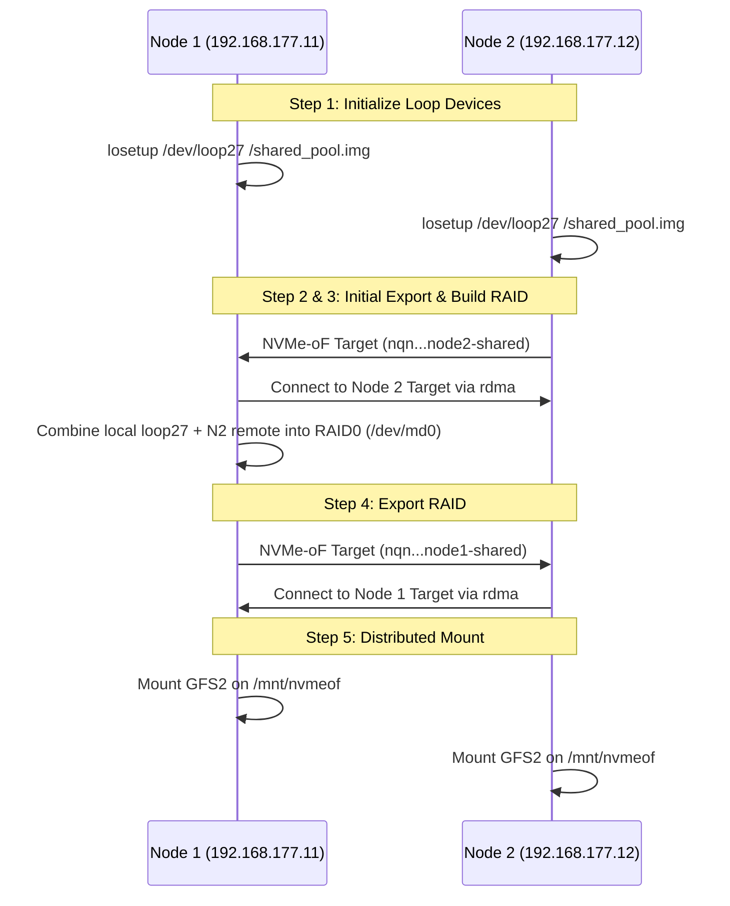

# Spark Storage Cluster

## Disclaimer
Use this project at your own risk. The author is in no way responsible for any data loss, and shall not be held liable for any damages caused by the use of these scripts or configurations. Ensure you have proper backups before using in any environment, especially production. Additionally, please note that these instructions were automatically generated and may contain mistakes.

## Background
This repository provides the configuration and bootstrap scripts to set up NVMe over Fabrics (NVMe-oF) between 2 DGX Spark nodes through a high-speed ConnectX-7 link. Instead of sharing an entire physical disk, this architecture leverages loop devices (backed by image files) on both machines, which are then combined into a wide, high-performance RAID0 array across the network.

## How it works
The architecture relies on a multi-tier storage mapping sequence leveraging NVMe-RDMA and `mdadm` for software RAID.

1. **Local Loop Setup:** Both Node 1 and Node 2 map a local image file (`/shared_pool.img`) to a specific loop device (e.g. `loop27`).
2. **First Export (Node 2 -> Node 1):** Node 2 configures an NVMe-oF target and exports its local loop device over the network to Node 1.
3. **RAID0 Assembly (Node 1):** Node 1 connects to Node 2's target, mapping it as a local remote block device. It then uses `mdadm` to combine its own local loop device and Node 2's remote block device into a single RAID0 array (`/dev/md0`).
4. **Second Export (Node 1 -> Node 2):** Node 1 configures another NVMe-oF target to export the newly created RAID0 block device back out to the cluster.
5. **Cluster Mount:** Both nodes mount the resulting NVMe-oF target (`/mnt/nvmeof`) using the GFS2 clustered file system (managed by Pacemaker).

### Component Message Flow


## Initial Configuration
Before running the scripts, you must prepare the cluster environment on both nodes. 

### 1. Install Required Packages
Ensure that all required dependencies are installed on both Node 1 and Node 2:
```bash
sudo apt update
sudo apt install -y nvme-cli mdadm pacemaker corosync pcs gfs2-utils dlm-controld
```

### 2. Create the Local Loop Device
Create the backing image file and attach it to a loop device. Run this on both Node 1 and Node 2:
```bash
# Create a 100GB sparse file for the shared pool (adjust size as needed)
dd if=/dev/zero of=/shared_pool.img bs=1M count=0 seek=102400

# Attach to the specific loop device
losetup /dev/loop27 /shared_pool.img
```

### 3. Configure Cluster Quorum & STONITH
Since this is a two-node cluster, you must configure Pacemaker to ignore standard quorum requirements. STONITH should be disabled or appropriately configured for a 2-node tiebreaker:
```bash
pcs cluster setup my_cluster node1 node2
pcs cluster start --all
pcs property set no-quorum-policy=ignore
pcs property set stonith-enabled=false
```
*(Note: In production, configure proper STONITH fencing agents instead of disabling it.)*

### 4. Configure the DLM (Distributed Lock Manager)
GFS2 requires DLM to coordinate file locks across both concurrent nodes.
```bash
pcs resource create dlm ocf:pacemaker:controld op monitor interval=30s on-fail=fence clone interleave=true ordered=true
```

## Script Configuration
Before deploying, make sure the variables align with your environment (default configuration used in the scripts provided). 

### Configuring HOSTNQN and SUBSYSTEMS
The NVMe-oF scripts use specific Host NQNs and Subsystem names for Target ACLs and mounting. 
- **HOSTNQN**: Generate a unique host NQN for each node and update the variables accordingly. You can generate one on each node using `nvme gen-hostnqn`. Note that standard systems will also persist this in `/etc/nvme/hostnqn`.
- **LOCAL_SUBSYSTEM / REMOTE_SUBSYSTEM**: These variables dictate the name the NVMe-oF target will be exported as. Make sure Node 1's `LOCAL_SUBSYSTEM` matches Node 2's `REMOTE_SUBSYSTEM` expectations, and vice versa.

```bash
# Generate a new HOSTNQN for Node 1
nvme gen-hostnqn
# Example Output: nqn.2014-08.org.nvmexpress:uuid:b5f22a9e-bfe0-11d3-8b92-30c5993d9a55
```

Update your `nvme-boot-node1.sh` and the Node 2 script with the proper IPs, Subsystems, and Host NQNs:

```bash
NODE1_IP="192.168.177.11"
NODE2_IP="192.168.177.12"
NVMET_PORT="4420"
LOCAL_SUBSYSTEM="nqn.2026-03.dgx:node1-shared"
REMOTE_SUBSYSTEM="nqn.2026-03.dgx:node2-shared"
MD_DEVICE="/dev/md0"
LOOP_DEVICE="/dev/loop27"
MOUNT_POINT="/mnt/nvmeof"
SHARED_POOL="/shared_pool.img"
NODE1_HOSTNQN="nqn.2014-08.org.nvmexpress:uuid:b5f22a9e-bfe0-11d3-8b92-30c5993d9a55"
NODE2_HOSTNQN="nqn.2014-08.org.nvmexpress:uuid:1d0edabc-bfdf-11d3-8d2d-30c5993def45"
```

## Boot Up Sequence
The initialization order is critical, as Node 1's RAID assembly depends on Node 2's target availability.

### Node 2 Boot Up
1. Cleanup any stale NVMe-oF state.
2. Initialize loop device (`/dev/loop27`) from `/shared_pool.img`.
3. Load properties `nvmet` and `nvmet-rdma` modules.
4. Expose the NVMe-oF target mapped to the local loop device over `NODE2_IP:4420`.
5. Wait for the `node1-shared` target from Node 1 to become available.
6. Connect to Node 1's target to map the combined RAID0 device.

### Node 1 Boot Up (`nvme-boot-node1.sh`)
1. **Cleanup**: unmounts stale directories, stops inactive RAID blocks, flushes NVMe queues, removes configuration trees.
2. **Loop Setup**: Force unbinds and re-maps `/shared_pool.img` directly to `/dev/loop27`. Validates block size successfully.
3. **Connect to Node 2**: Probes `nvme-rdma`. Polls (up to 300 seconds) for Node 2 to export `node2-shared`. Connects target once available.
4. **Scan Protocol**: Performs robust, fail-safe background scanning over NVMe subsystem directories `nvme[1-9]*n[1-9]*` for the correct remote namespace.
5. **Persistent RAID Assembly/Sync**: Employs `mdadm` to tie `/dev/loop27` + remote `node2` NVMe path to `/dev/md0`. Inits sync if missing metadata.
6. **Export Target**: Creates NVMe Subsystem Target `node1-shared` tying to `/dev/md0`. Employs Host ACLs restricting to Node 1 and Node 2 via explicit NQN mapping.
7. **Pacemaker Ready**: Saves RAID properties via `/etc/mdadm/mdadm.conf` handing mount permissions up system hierarchy (GFS2).

## Useful Commands

Here are some commands that are helpful for managing and monitoring the NVMe-oF cluster:

- **Check Cluster & Shared Storage Health:**
  ```bash
  pcs status
  ```
- **List NVMe Devices (Check active NVMe-oF connections):**
  ```bash
  nvme list
  ```
- **Discover Remote NVMe Targets:**
  ```bash
  nvme discover -t rdma -a <remote_ip> -s 4420
  ```
- **Check RAID Array Health (Node 1 only):**
  ```bash
  mdadm --detail /dev/md0
  cat /proc/mdstat
  ```
- **View DLM Lockspaces (GFS2 Locks):**
  ```bash
  dlm_tool ls
  ```

## Troubleshooting

Because this architecture relies heavily on tight coupling through RAID0, both nodes must remain healthy to maintain array consistency.

### If Node 1 Fails
- **Impact**: Node 1 manages the software RAID. A failure will instantly offline the `/dev/md0` array. Node 2 will lose its connection to the `node1-shared` target, and any active IO to `/mnt/nvmeof` will hang.
- **Recovery**: 
  1. Boot up Node 1.
  2. Run the boot sequence on Node 1. Since Node 2's target handles loop export independently, Node 1 will reconnect, detecting the existing superblocks during `mdadm --assemble`.
  3. Once Node 1 re-exports the assembled array, Node 2's driver should automatically reconnect (or gracefully timeout, requiring Pacemaker to remount the GFS2 resource).

### If Node 2 Fails
- **Impact**: Node 2's NVMe target goes offline, causing the `mdadm` RAID0 array on Node 1 to drop a leg. Because it's RAID0, the entire array is degraded and unreadable, causing Node 1's target to hang.
- **Recovery**:
  1. Reboot Node 2 and run its boot sequence (make sure it exposes its loop device target natively again).
  2. On Node 1, restart the NVMe-oF connection. It may be necessary to run the `nvme-boot-node1.sh` bootstrap sequence to clear stalled NVMe queues, rescan block targets, and cleanly re-assemble `/dev/md0` from both legs without data collision.
